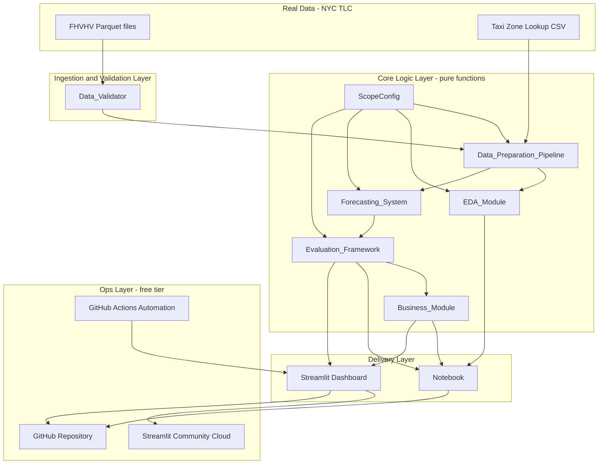

# Design Document

## Overview

This design describes how the **Ride-Hailing Demand Forecasting** project is built end to end: from validating the raw NYC TLC FHVHV Parquet data, through EDA, data preparation, a broad model comparison, honest evaluation, a business recommendation, and finally the notebook, dashboard, automation, and public deployment.

The design is organized around the "golden rule": only real public NYC TLC data is used, every transformation is validated against ground truth, and every reported number is defensible. To make that enforceable rather than aspirational, the pure-logic parts of the pipeline (aggregation, zero-fill, lag features, the train/holdout split, and the error metrics) are designed as deterministic functions whose correctness can be checked automatically — see the Correctness Properties section.

### Key Design Decisions (proposed defaults, confirmable)

The requirements fix the *shape* of the scope but leave the concrete values to the design. The following defaults are proposed with rationale and can be adjusted before implementation:

| Scope value | Proposed default | Rationale |
|---|---|---|
| **Time_Grain** | **Daily** | Daily demand per region over 12-24 months yields a clean, complete series (~2k rows) that every model in the candidate set — including VAR and SARIMA — can train on without excessive compute. Intraday (hourly) patterns are still explored descriptively in EDA to inform positioning, but the *forecasting* grain stays single and consistent per Requirement 2.1. |
| **Geographic_Grain** | **Borough** (Manhattan, Brooklyn, Queens, Bronx, Staten Island, EWR) | Boroughs give a small, stable set of parallel series ideal for multivariate (VAR/VARMAX) joint forecasting, and map directly to a driver-positioning story. Taxi-zone grain (~260 zones) is too sparse per day for stable daily forecasting. |
| **Analysis_Window** | **12 months ending 2026-04** (2025-05 → 2026-04) | Satisfies the 12-24 month requirement, captures a full annual seasonal cycle, ends on the already-downloaded `fhvhv_2026-04.parquet`, and keeps total download volume manageable (12 monthly FHVHV files). Extendable to 18-24 months if compute/storage allow. |
| **Candidate_Model_Set** | Holt-Winters, SARIMA (+ SARIMAX variant), VAR/VARMAX, Prophet, XGBoost (lag features), LSTM (+ GRU variant) | Covers baseline → classical univariate → multivariate → modern → ML → deep learning, satisfying Requirement 5 and the algorithm-breadth rule. |

These defaults appear in a single `ScopeConfig` object (see Data Models) so the "single documented value used consistently" requirement is structurally guaranteed — every component reads scope from one source.

### Data Source Reality Check

Only one month (`fhvhv_2026-04.parquet`) is currently downloaded and **not yet validated**. Phase 1 validates it first (Requirement 1) before any window expansion or modeling. FHVHV monthly files are large (~1 GB each); downloads and heavy model fits are long-running jobs the user runs in their own terminal, with Kiro supplying verified code and run instructions (per the working method).

## Architecture

The project is a Python data-science pipeline with a layered architecture. Pure data/logic layers are separated from I/O and presentation so the logic can be validated independently.



### Layer responsibilities

- **Ingestion and Validation** — Loads Parquet with `pyarrow`/`pandas`, profiles schema/nulls/dates/duplicates/domain violations, and produces a `ValidationReport`. Runs before modeling and again after preparation (Requirements 1, 4.5, 13.4).
- **Core Logic (pure)** — Aggregation, zero-fill, lag features, train/holdout split, metric computation, model selection. These are deterministic functions with no I/O, which is what makes property-based testing possible.
- **Delivery** — The notebook (guided story) and the Streamlit dashboard (sidebar-navigated storytelling + optional upload mode).
- **Ops** — GitHub Actions for automation, Streamlit Community Cloud for hosting, and a clean GitHub repo with `.gitignore` discipline.

### Repository layout

```
ride-hailing-demand-forecasting/
├── README.md
├── .gitignore                # excludes data/, .venv/, secrets, brief file
├── requirements.txt
├── notebook/
│   └── demand_forecasting.ipynb
├── src/
│   ├── config.py             # ScopeConfig
│   ├── validation.py         # Data_Validator
│   ├── preparation.py        # Data_Preparation_Pipeline (pure)
│   ├── eda.py                # EDA_Module
│   ├── models/               # one module per model family
│   ├── evaluation.py         # Evaluation_Framework (pure)
│   └── business.py           # Business_Module
├── dashboard/
│   └── app.py                # Streamlit
├── tests/
│   ├── test_preparation.py   # property + unit tests
│   ├── test_evaluation.py    # property + unit tests
│   └── test_validation.py
├── .github/workflows/
│   └── refresh.yml           # scheduled auto-refresh
└── data/                     # git-ignored; local Parquet lives here
```

## Components and Interfaces

### Data_Validator (`src/validation.py`)

Profiles and validates raw and prepared data. Pure with respect to a loaded DataFrame (file loading is the only I/O).

```python
def load_parquet(path: str) -> pd.DataFrame: ...

def profile_schema(df) -> SchemaReport:
    # row count, column names, dtype per column  (R1.2)

def profile_nulls(df) -> dict[str, NullStat]:
    # count and percentage of nulls per column   (R1.3)

def pickup_date_range(df, ts_col="pickup_datetime") -> tuple[Timestamp, Timestamp]:
    # min/max pickup timestamp                    (R1.4)

def count_duplicates(df) -> int:                 # (R1.5)

def flag_domain_violations(df, scope: ScopeConfig) -> list[DomainViolation]:
    # e.g. pickups outside stated month, negatives; count + example  (R1.6)

def build_validation_report(df, scope) -> ValidationReport:  # aggregates all above (R1.8)

def revalidate_prepared(series: DemandSeries, raw_valid_count: int) -> ReconciliationReport:
    # aggregated totals reconcile with raw counts  (R4.5, R13.4)
```

### Data_Preparation_Pipeline (`src/preparation.py`) — pure

Transforms validated raw records into the forecasting dataset. This is the most property-rich component.

```python
def apply_validity_rules(df, scope) -> tuple[pd.DataFrame, HandlingLog]:
    # documented handling for invalid records (R4.4)

def map_zones_to_regions(df, zone_lookup) -> pd.DataFrame:
    # PULocationID -> borough (Geographic_Grain)

def aggregate_demand(df, scope) -> DemandSeries:
    # count trips per (period, region) at Time_Grain (R4.1)

def fill_missing_periods(series, scope) -> DemandSeries:
    # every (period, region) in window present; missing => 0 (R4.3)

def add_lag_features(series, lags: list[int]) -> DemandSeries:
    # lag_k[t] = demand[t-k] per region (R4.6)

def prepare(df, zone_lookup, scope) -> tuple[DemandSeries, HandlingLog, list[BeforeAfter]]:
    # orchestrates; records before/after examples (R4.2)
```

### EDA_Module (`src/eda.py`)

Produces plots and statistics with plain-language interpretations. Chart-producing; not property-tested.

```python
def plot_demand_series(series, scope): ...                  # R3.1
def seasonal_decompose_demand(series) -> Decomposition: ... # R3.2
def adf_test(series) -> ADFResult:                          # R3.3 (statistic, p-value)
def acf_pacf(series) -> ACFResult: ...                      # R3.4
def detect_anomalies(series) -> list[Anomaly]: ...          # R3.5
def demand_correlations(series, exog) -> pd.DataFrame: ...  # R3.6
```

### Forecasting_System (`src/models/`)

One trainer per family, all sharing a common interface so evaluation is uniform.

```python
class Forecaster(Protocol):
    name: str
    def fit(self, train: DemandSeries, scope: ScopeConfig) -> None: ...
    def predict(self, horizon: int) -> Forecast: ...

# Implementations: HoltWinters, Sarima/Sarimax, VarVarmax,
#                  ProphetModel, XGBoostLags, LSTMModel/GRUModel
def train_all(train, scope) -> list[TrainedModel | ExclusionRecord]:
    # trains every candidate; records reason if a model cannot train (R5.8)
```

All models forecast over the same `Holdout_Set` (R5.7).

### Evaluation_Framework (`src/evaluation.py`) — pure

```python
def split_holdout(series, holdout_periods: int) -> tuple[DemandSeries, DemandSeries]:
    # most-recent contiguous block reserved; disjoint from train (R6.1)

def error_metrics(actual, forecast) -> Metrics:   # MAE, RMSE, MAPE (R6.2)

def comparison_table(results: list[ModelResult]) -> pd.DataFrame:
    # same metrics for every model, losers included (R6.3)

def error_by_period(actual, forecast, buckets) -> pd.DataFrame:
    # error across distinct periods, not just aggregate (R6.5)

def select_carry_forward(table) -> list[str]:
    # choose 3-5 models with documented justification (R6.6)
```

### Business_Module (`src/business.py`)

```python
def positioning_recommendation(forecast, scope) -> Recommendation:   # R7.1
def quantify_impact(recommendation, assumptions) -> ImpactStatement: # R7.2, R7.3
def india_generalization() -> str:                                   # R7.4
```

### Dashboard (`dashboard/app.py`)

Streamlit app with sidebar navigation across the required story sections (R9.1, R9.2), model comparison + forecast visuals (R9.3), and an optional upload-and-analyze mode with input-format validation (R9.4, R9.5). Reuses `src/` functions so dashboard and notebook stay consistent.

### Automation (`.github/workflows/refresh.yml`)

A scheduled GitHub Actions workflow (free tier) that re-runs the prepare→forecast pipeline on a cron schedule and logs success/failure (R10). The upload-and-analyze capability is served by the dashboard.

## Data Models

### ScopeConfig — single source of truth for scope (Requirement 2)

```python
@dataclass(frozen=True)
class ScopeConfig:
    time_grain: str              # "daily"
    geographic_grain: str        # "borough"
    window_start: date           # 2025-05-01
    window_end: date             # 2026-04-30
    candidate_models: list[str]
    holdout_periods: int         # e.g. 30 days
    lags: list[int]              # e.g. [1, 7, 14]
    change_log: list[ScopeChange]  # records post-definition changes (R2.5)
```

### Raw FHVHV record (subset of the real NYC TLC schema)

| Column | Type | Use |
|---|---|---|
| `hvfhs_license_num` | str | platform (Uber/Lyft) |
| `pickup_datetime` | timestamp | time grain + date-range validation |
| `PULocationID` | int | joined to zone lookup → borough |
| `DOLocationID` | int | (context) |
| `trip_miles`, `trip_time`, `base_passenger_fare`, `driver_pay`, ... | numeric | domain checks / candidate exog vars |

Demand is defined as the **count of trips** per `(period, region)`. A `taxi_zone_lookup` table maps `PULocationID → borough`.

### DemandSeries (long format)

| Field | Type | Notes |
|---|---|---|
| `period` | timestamp | at Time_Grain; complete/contiguous after zero-fill |
| `region` | str | borough |
| `demand` | int ≥ 0 | trip count; 0 for empty periods (R4.3) |
| `lag_1`, `lag_7`, ... | int/NaN | lag features (R4.6) |
| calendar features | derived | day-of-week, month, holiday flag |

### Reports and results

```python
@dataclass
class ValidationReport:
    schema: SchemaReport
    nulls: dict[str, NullStat]
    date_range: tuple[Timestamp, Timestamp]
    duplicate_count: int
    domain_violations: list[DomainViolation]  # each has count + example

@dataclass
class Metrics:
    mae: float; rmse: float; mape: float      # all >= 0

@dataclass
class ModelResult:
    model_name: str
    metrics: Metrics
    forecast: Forecast
    excluded_reason: str | None

@dataclass
class Recommendation:
    region: str; period: Timestamp; predicted_demand: float
    action: str; impact: ImpactStatement
```

## Correctness Properties

*A property is a characteristic or behavior that should hold true across all valid executions of a system — essentially, a formal statement about what the system should do. Properties serve as the bridge between human-readable specifications and machine-verifiable correctness guarantees.*

These properties apply to the project's **pure-logic layers** — data profiling, aggregation, zero-fill, invalid-record handling, lag features, the train/holdout split, error metrics, model selection, impact calculation, and upload validation. These are deterministic functions with large input spaces where "for all inputs X, P(X) holds" is meaningful, so bugs hide in edge cases (empty periods, ties, single-region series, all-zero demand) that 100+ generated inputs surface far better than a few examples.

Generated-input testing is **deliberately not** applied to: EDA charts and third-party statistical wrappers (ADF, decomposition, correlation — already tested by `statsmodels`/`pandas`), model fitting (stochastic and heavy — covered by integration examples), the notebook and dashboard rendering (covered by smoke/execution tests), and automation/deployment/repo hygiene (covered by configuration and smoke checks). See the Testing Strategy for how those are handled.

### Property 1: Profiling accuracy

*For any* loaded DataFrame, every profiling statistic the Data_Validator reports — row count, column set and dtypes, per-column null count and percentage, and the min/max pickup timestamp — equals the ground-truth value computed directly from that DataFrame.

**Validates: Requirements 1.2, 1.3, 1.4**

### Property 2: Duplicate and domain-violation flagging

*For any* DataFrame into which a known number of duplicate rows and out-of-domain records (pickups outside the stated month, negative counts/fares) have been injected, the reported duplicate count equals the true number of duplicates, and the flagged violations count equals the number injected with each flagged item being a genuinely violating record.

**Validates: Requirements 1.5, 1.6**

### Property 3: Aggregation correctness and reconciliation

*For any* set of valid raw trip records, aggregating to the Time_Grain and Geographic_Grain produces a demand series whose per-bucket counts equal a direct group-by of the records, and whose total demand summed across all buckets equals the number of valid raw records (conservation).

**Validates: Requirements 4.1, 4.5, 13.4**

### Property 4: Zero-fill completeness

*For any* Analysis_Window and any subset of populated `(period, region)` buckets, the prepared series contains exactly one row for every `(period, region)` combination in the window — none omitted — and demand is exactly 0 for every combination that had no input records.

**Validates: Requirements 4.3, 13.4**

### Property 5: Invalid-record handling

*For any* dataset with injected records that fail the validity checks from Requirement 1, after the documented handling rule is applied no invalid record remains in the output and the HandlingLog count equals the number of invalid records injected.

**Validates: Requirements 4.4**

### Property 6: Lag feature correctness

*For any* demand series and any lag k, within each region the value of `lag_k` at period t equals the demand at period t−k, and is undefined (NaN) for the first k periods of that region.

**Validates: Requirements 4.6**

### Property 7: Holdout split has no leakage

*For any* demand series and any holdout size n (1 ≤ n < series length), the split yields a holdout equal to the most recent n contiguous periods and a training set equal to the remaining earlier periods, such that the two are disjoint and their concatenation reconstructs the original series exactly.

**Validates: Requirements 6.1**

### Property 8: Error-metric correctness

*For any* aligned actual and forecast arrays, MAE, RMSE, and MAPE are all non-negative; when the forecast equals the actual values every metric is exactly 0; and RMSE is always greater than or equal to MAE.

**Validates: Requirements 6.2**

### Property 9: Comparison table completeness

*For any* list of model results (including underperforming and excluded models), the comparison table contains exactly one row per model with the same set of metric columns for each.

**Validates: Requirements 6.3**

### Property 10: Error-by-period partition

*For any* aligned actual and forecast over the holdout and any period bucketing, each per-bucket error is non-negative and the buckets partition the holdout periods — every holdout period belongs to exactly one bucket.

**Validates: Requirements 6.5**

### Property 11: Carry-forward selection count

*For any* comparison table containing at least three models, the carry-forward selection returns between three and five model names, and every returned name is present in the table.

**Validates: Requirements 6.6**

### Property 12: Impact calculation reproducibility

*For any* set of documented assumptions, the quantified benefit reported by the Business_Module equals the value obtained by recomputing the documented formula from those same assumptions.

**Validates: Requirements 7.3**

### Property 13: Upload input validation

*For any* uploaded dataset that is missing a required column or has a corrupted dtype, the dashboard's upload validator returns an error that references the offending column; and *for any* fully conforming dataset, validation passes.

**Validates: Requirements 9.5**

## Error Handling

Errors are handled honestly — surfaced and documented rather than hidden — consistent with the golden rule (Requirements 13.2, 13.3).

| Failure | Handling |
|---|---|
| Parquet file missing/unreadable | `load_parquet` raises a clear error naming the path; validation halts before any modeling (R1.8). |
| Column outside valid domain | Recorded in `ValidationReport.domain_violations` with count and example; not silently dropped (R1.6). Preparation applies the documented handling rule and logs it (R4.4). |
| Empty periods in the window | Filled with 0 demand, never omitted (R4.3). |
| A candidate model fails to train (e.g. VAR on a single region, insufficient history) | Caught per-model; an `ExclusionRecord` with the reason is stored and the model appears in the comparison as excluded (R5.8). One model failing never aborts the others. |
| MAPE with zero actuals | Guarded (zeros excluded or symmetric MAPE used); the chosen convention is documented so metrics stay defensible (R6.2). |
| Non-conforming dashboard upload | `validate_upload` returns a descriptive error naming the missing/invalid column instead of crashing (R9.5). |
| Automated run fails | GitHub Actions marks the run failed and the failure is preserved in the run logs (R10.4). |
| Result looks inconsistent with expectation | Investigated and documented as a finding; unresolved issues recorded as explicit limitations (R13.2, R13.3). |

## Testing Strategy

A dual approach: **property-based tests** for universal correctness of pure logic, and **example / integration / smoke tests** for concrete behavior, third-party wrappers, and infrastructure. Unit tests are kept focused — the property tests carry the burden of broad input coverage.

### Property-based tests

- Library: **Hypothesis** (Python).
- Each of Properties 1-13 is implemented by a **single** property-based test.
- Each test runs a **minimum of 100 iterations**.
- Generators produce realistic edge cases: empty frames, single-region series, all-zero demand, sparse windows, injected duplicates/violations, ties in metrics, and holdout sizes spanning the valid range.
- Each test is tagged with a comment referencing its design property, format:
  `# Feature: ride-hailing-demand-forecasting, Property {number}: {property_text}`

### Example-based unit tests

- Scope: seasonal decomposition returns three components of correct length (R3.2), ADF returns a statistic and p-value in range (R3.3), correlation matrix within [-1, 1] (R3.6), each model forecast aligns to the holdout index (R5.7), model exclusion recorded on forced failure (R5.8), recommendation produced for a sample forecast (R7.1), window validator accepts 12-24 months and rejects otherwise (R2.3), scope-change logging (R2.5), and multi-file validation orchestration (R1.7).

### Integration tests

- Scope: each model family (Holt-Winters, SARIMA/SARIMAX, VAR/VARMAX, Prophet, XGBoost, LSTM/GRU) fits on a small fixture series and produces a forecast of expected length (R5.1-5.6) — 1-3 examples per model, not property tests, because fitting is stochastic and expensive.
- A forced-failure automation run records the failure in logs (R10.4).

### Smoke and execution tests

- Notebook executes top-to-bottom without error via `nbconvert`/`papermill` in CI (R8.6).
- Dashboard app imports and renders its sections; upload of a valid fixture returns results (R9.1-9.4).
- Repository hygiene checks: README present with data source/results/roadmap (R12.1); `.gitignore` excludes `data/`, virtual envs, secrets, and the brief file (R12.3, R12.4); phase-by-phase commit history (R12.2).
- Deployment: manual confirmation the public Streamlit Community Cloud URL loads without local setup (R11).

### Manual review checklist (non-machine-testable criteria)

- Data source provenance is NYC TLC only (R1.1, R13.1).
- Every code cell has explanation above and interpretation below; new tools explained on first use (R8.2-8.5).
- Every chart/statistic has a plain-language interpretation (R3.7).
- Business impact expressed in business terms and India generalization present (R7.2, R7.4).
- Inconsistent results investigated and documented; limitations stated explicitly (R13.2, R13.3).
